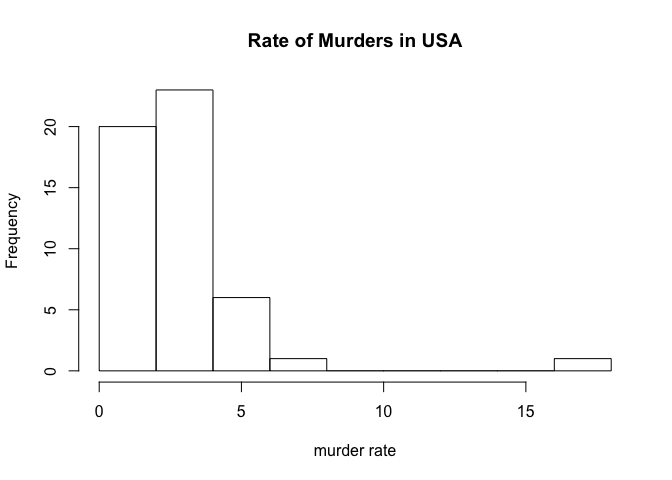

test
================

``` r
url <- "https://raw.githubusercontent.com/rafalab/dslabs/master/inst/extdata/murders.csv" 

dest_file <- "data/murders.csv" 

download.file(url, destfile = dest_file)
```

``` r
library(tidyverse)
```

    ## ── Attaching packages ────────────────────────────────────────────────────────── tidyverse 1.2.1 ──

    ## ✔ ggplot2 3.1.0     ✔ purrr   0.2.5
    ## ✔ tibble  1.4.2     ✔ dplyr   0.7.7
    ## ✔ tidyr   0.8.2     ✔ stringr 1.3.1
    ## ✔ readr   1.1.1     ✔ forcats 0.3.0

    ## ── Conflicts ───────────────────────────────────────────────────────────── tidyverse_conflicts() ──
    ## ✖ dplyr::filter() masks stats::filter()
    ## ✖ dplyr::lag()    masks stats::lag()

``` r
murders <- read.csv("data/murders.csv")

murders <- murders %>% mutate(region = factor(region), rate = total / population * 10^5)

save(murders, file = "rda/murders.rda")                              
```


